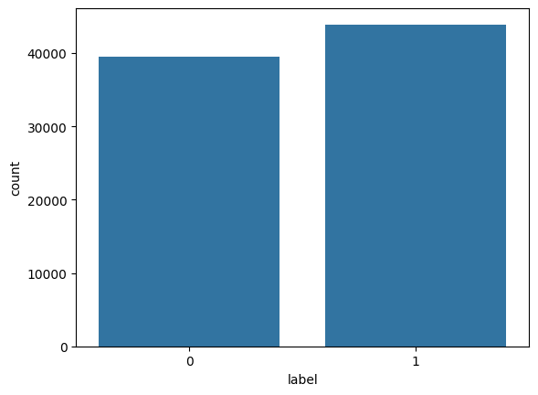
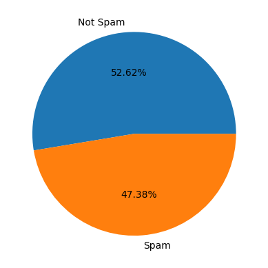
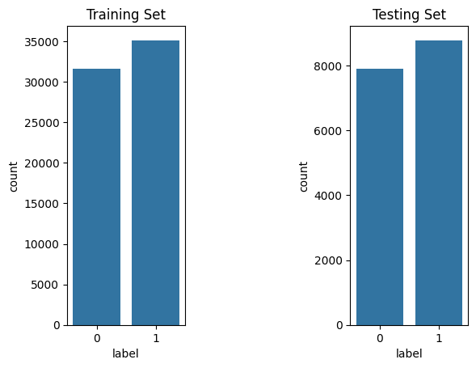
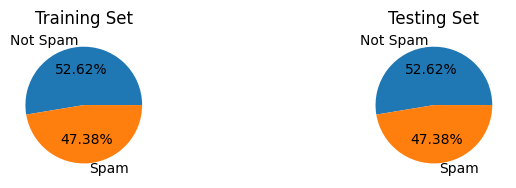
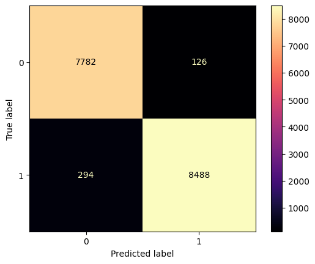

# Spam Email Classification Using Naive Bayes
#### https://spam-email-classification.onrender.com
## Project Overview

This project aims to classify emails as spam or not spam using the Naive Bayes algorithm. The model is trained on a dataset from Kaggle and deployed via a Flask web application.

## Table of Contents

- [Spam Email Classification Using Naive Bayes](#spam-email-classification-using-naive-bayes)
  - [Project Overview](#project-overview)
  - [Table of Contents](#table-of-contents)
  - [Dataset](#dataset)
  - [Model Training](#model-training)
    - [1. Importing Libraries](#1-importing-libraries)
    - [2. Reading and Exploring the Data](#2-reading-and-exploring-the-data)
    - [3. Data Preprocessing](#3-data-preprocessing)
    - [4. Data Visualization](#4-data-visualization)
    - [5. Splitting the Data](#5-splitting-the-data)
    - [6. Vectorization](#6-vectorization)
    - [7. Model Training](#7-model-training)
    - [8. Model Evaluation](#8-model-evaluation)
    - [Exporting the Model](#exporting-the-model)
  - [Flask Application](#flask-application)
    - [Structure](#structure)
    - [app.py](#apppy)
  - [Setup and Installation](#setup-and-installation)
    - [Prerequisites](#prerequisites)
    - [Installation Steps](#installation-steps)
    - [1. Clone the repository:](#1-clone-the-repository)
    - [2. Navigate to the project directory:](#2-navigate-to-the-project-directory)
    - [3. Create a virtual environment and activate it:](#3-create-a-virtual-environment-and-activate-it)
    - [4. Install the required packages:](#4-install-the-required-packages)
  - [Usage](#usage)
    - [1. Run the Flask application:](#1-run-the-flask-application)
    - [2. Open your web browser and go to http://127.0.0.1:5000/](#2-open-your-web-browser-and-go-to-http1270015000)
    - [3. Enter the email text and click on the "Predict" button to see if the email is spam or not.](#3-enter-the-email-text-and-click-on-the-predict-button-to-see-if-the-email-is-spam-or-not)
  - [Results](#results)
  - [Contributing](#contributing)
  - [License](#license)

## Dataset

The dataset used for training and evaluating the model is the Email Spam Classification Dataset from Kaggle. It consists of labeled email texts indicating whether they are spam or not spam.

Dataset link: [Email Spam Classification Dataset](https://www.kaggle.com/datasets/purusinghvi/email-spam-classification-dataset?resource=download)

## Model Training

### 1. Importing Libraries

The project utilizes several Python libraries for data manipulation, visualization, and machine learning, such as pandas, seaborn, and scikit-learn.

### 2. Reading and Exploring the Data

The dataset is loaded into a pandas DataFrame for exploration and preprocessing.

```python
import pandas as pd
data = pd.read_csv('./combined_data.csv')
```

### 3. Data Preprocessing

-   **Handling Duplicates:** Ensuring there are no duplicate entries.
-   **Checking for Missing Values:** Ensuring there are no missing values in the dataset.

### 4. Data Visualization

Visualizing the distribution of spam and non-spam emails helps in understanding the dataset better. This includes:

Count plot of spam and non-spam emails.
Pie chart showing the proportion of spam and non-spam emails.





### 5. Splitting the Data

The data is split into training and testing sets with an 80-20 ratio to evaluate the model's performance.

```python
from sklearn.model_selection import train_test_split

inputs = data["text"]
target = data["label"]
x_train, x_test, y_train, y_test = train_test_split(inputs, target, test_size=0.2, random_state=7, stratify=target)
```





### 6. Vectorization

Text data is converted into numerical form using CountVectorizer.

```python
from sklearn.feature_extraction.text import CountVectorizer

vectorizer = CountVectorizer()
x_train_transf = vectorizer.fit_transform(x_train)
x_test_transf = vectorizer.transform(x_test)
```

### 7. Model Training

A Multinomial Naive Bayes model is used for classification due to its effectiveness in text classification tasks.

```python
from sklearn.naive_bayes import MultinomialNB

model = MultinomialNB()
model.fit(x_train_transf, y_train)
```

### 8. Model Evaluation

The model is evaluated using a confusion matrix and a classification report, providing insights into precision, recall, and F1-score.

```python
from sklearn.metrics import classification_report, ConfusionMatrixDisplay

y_test_pred = model.predict(x_test_transf)
print(classification_report(y_test, y_test_pred, target_names=['Ham', 'Spam']))

ConfusionMatrixDisplay.from_predictions(y_test, y_test_pred)
```

### Exporting the Model

The trained model and vectorizer are saved using pickle for later use in the Flask application.

```python
import pickle

pickle.dump(vectorizer, open('./model/vectorizer.pkl', 'wb'))
pickle.dump(model, open('./model/model.pkl', 'wb'))
```

## Flask Application

The Flask application provides a web interface to interact with the spam classification model.

### Structure

**app.py:** Contains the Flask application code.  
**model/:** Directory where the trained model and vectorizer are stored.  
**templates/:** Contains index.html for the front-end.  
**static/:** Contains resources for application.

### app.py

The Flask application loads the trained model and vectorizer and sets up routes for the web interface.

## Setup and Installation

### Prerequisites

-   Python 3.6 or higher
-   pip (Python package installer)

### Installation Steps

### 1. Clone the repository:

```bash
git clone https://github.com/yourusername/spam-email-classification.git
```

### 2. Navigate to the project directory:

```bash
cd spam-email-classification
```

### 3. Create a virtual environment and activate it:

```bash
python -m venv venv
source venv/bin/activate  # On Windows, use `venv\Scripts\activate`
```

### 4. Install the required packages:

```bash
pip install -r requirements.txt
```

## Usage

### 1. Run the Flask application:

```bash
python app.py
```

### 2. Open your web browser and go to http://127.0.0.1:5000/

### 3. Enter the email text and click on the "Predict" button to see if the email is spam or not.

## Results

The model achieves high accuracy on the test dataset:

Precision: 0.99 for spam, 0.96 for not spam  
Recall: 0.97 for spam, 0.98 for not spam  
F1-score: 0.98 for spam, 0.97 for not spam



## Contributing

Contributions are welcome! Please create a pull request or submit an issue if you have any suggestions or improvements.

## License

This project is licensed under the MIT License.
